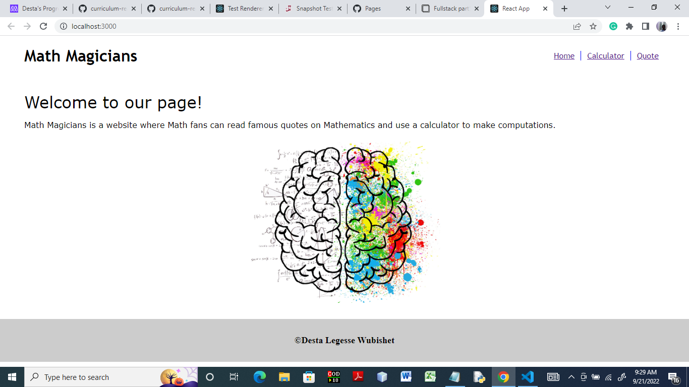
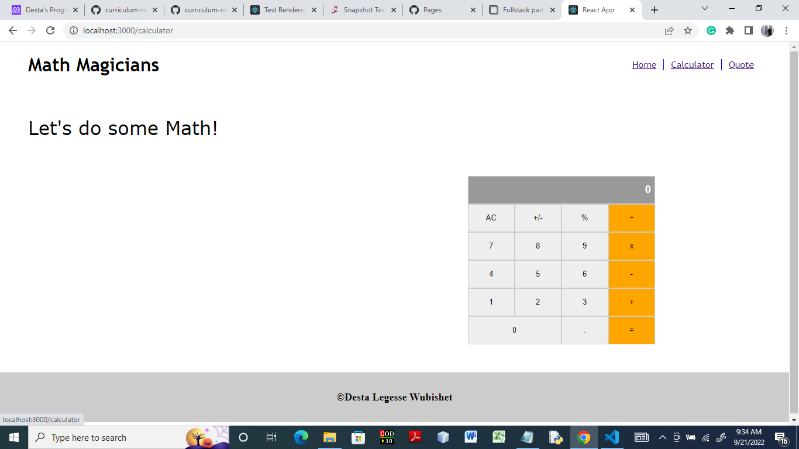
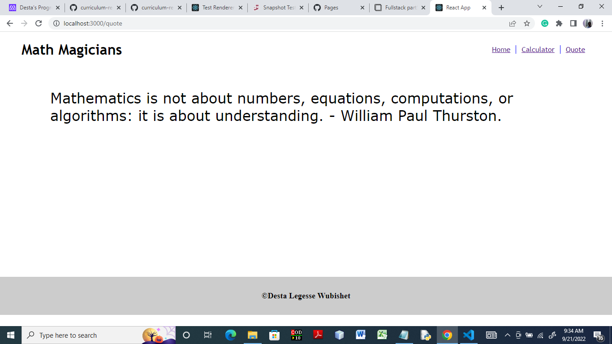

# Math Magicians

> Math Magicians is a React website where Math fans make simple calculations and read random Math quotes.

## Built With

- React
- React Router 6

## Live Demo (if available)

[Live Demo Link]()

## Getting Started

To get a local copy of the code, please follow these step: 
1. Open Visual Studio Code 
2. Go to the current directory where you want the cloned directory to be added. To do this, input cd in your VS code terminal and add your folder location.
3. Go to the page of this repository
4. Click on the green "Clone" button, a drodown box with a "Copy and Paste" button appears. Click on this button. It copies the URL for the repository.
5. Input 'git clone' in your VS code terminal and paste the URL link.

## Authors

👤 **Desta Legesse Wubishet**

- GitHub: https://github.com/dlwub
- Twitter: [@DestaWubishet](https://twitter.com/DestaWubishet)
- LinkedIn: https://www.linkedin.com/in/desta-legesse-w-509844213/

## 🤝 Contributing

Contributions, issues, and feature requests are welcome!

Feel free to check the [issues page](../../issues/).

## Show your support

Give a ⭐️ if you like this project!

## Acknowledgments

Microverse

## 📝 License

This project is licensed by [MIT](MIT.md).
